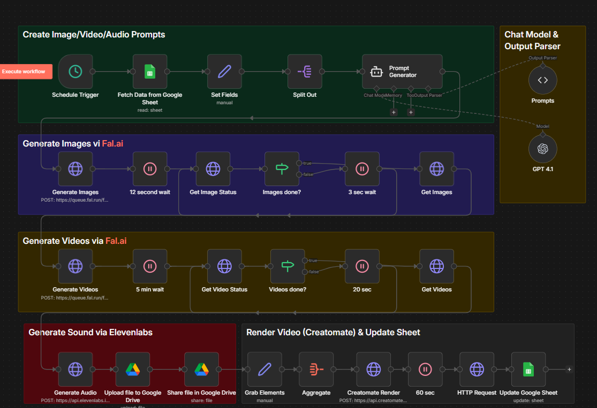

# Food Brands Reimagined

## Automated AI Video Generation with n8n

<br>

**n8n Automation Workshop**

---

# What We're Building

<br>

### Transform brand names into stunning AI-generated videos featuring miniature architectural worlds

<br>

**▶ Sample Output:**
https://f002.backblazeb2.com/file/creatomate-c8xg3hsxdu/59de5667-910e-4105-8956-67b1e9754470.mp4

---

# Use Cases

<br>

| Icon | Use Case | Description |
|:----:|----------|-------------|
| 📱 | **Social Media Content** | Instagram Reels, TikTok, YouTube Shorts |
| 🏢 | **Brand Awareness** | Creative brand representations |
| 🎨 | **Marketing Agencies** | Rapid concept prototyping |
| 🍔 | **Food & Restaurant** | Already configured! |

---

# Adaptable for Any Industry

<br>

| | |
|:---:|:---:|
| 🛍️ **Product Showcases** | 🎓 **Educational Content** |
| 📹 **UGC-Style Videos** | 🏠 **Real Estate Marketing** |
| 🎉 **Event Promotion** | 🎮 **Gaming & Entertainment** |

<br>

> **Just modify the system prompt to change the creative direction**

---

# Workflow Pipeline Overview

<br>

```
📊 INPUT        🤖 AI PROMPTS      🎨 GENERATE       🎬 OUTPUT
─────────────────────────────────────────────────────────────────
Google          GPT-4.1 creates    Images, Videos,   Creatomate
Sheets          image/video/       Audio generated   combines into
                audio prompts      in parallel       final video
```

<br>

**⏱️ Total processing time: ~10-15 minutes per batch of 4 brands**

---

# Workflow Architecture



---

# Phase 1: Data Input

<br>

| Step | Node | What It Does |
|:----:|------|--------------|
| 1️⃣ | **Schedule Trigger** | Runs workflow automatically |
| 2️⃣ | **Google Sheets** | Fetches rows where Status = "To Do" |
| 3️⃣ | **Set Fields** | Converts brands to array |
| 4️⃣ | **Split Out** | Separates into 4 items for parallel processing |

<br>

```
Input: Category + Brand 1, Brand 2, Brand 3, Brand 4
Output: 4 separate items, one per brand
```

---

# Phase 2: AI Prompt Generation

<br>

**GPT-4.1 + AI Agent** generates 3 coordinated prompts per brand:

<br>

| Prompt | Purpose |
|--------|---------|
| 📸 **Image Prompt** | "A hyperrealistic tiny building shaped like [brand's iconic product]..." |
| 🎬 **Video Prompt** | "A slow 5-second cinematic pan with tiny people moving..." |
| 🎵 **Audio Prompt** | "A chill, brand-aligned lo-fi beat that matches the vibe..." |

<br>

> **The System Message is the creative brain of the workflow**

---

# Phase 3: Media Generation

<br>

| 🖼️ Images | 🎬 Videos | 🎵 Audio |
|:---------:|:---------:|:--------:|
| Fal.ai Flux Pro | Fal.ai Kling v2.6 | ElevenLabs |
| Submit request | Submit request | Generate clip |
| Poll status | Poll status | Upload to Drive |
| Get image URL | Get video URL | Get public URL |
| **⏱️ ~15 sec** | **⏱️ ~5 min** | **⏱️ ~10 sec** |

<br>

> Image → feeds into → Video (image-to-video generation)

---

# Phase 4: Final Composition

<br>

```
        4 Videos + 4 Audio Clips
                  ↓
           ┌───────────┐
           │ Aggregate │  Combine all media
           └─────┬─────┘
                 ↓
           ┌───────────┐
           │Creatomate │  Render using template
           └─────┬─────┘
                 ↓
           ┌───────────┐
           │  Output   │  Final MP4 video (~20 sec)
           └─────┬─────┘
                 ↓
           ┌───────────┐
           │  Update   │  Status = "Done" + URL
           │  Sheet    │
           └───────────┘
```

---

# Tech Stack

<br>

| Service | Purpose |
|---------|---------|
| 📊 **Google Sheets** | Data input & status tracking |
| 🧠 **OpenAI GPT-4.1** | Prompt generation |
| 🖼️ **Fal.ai Flux Pro** | Image generation |
| 🎬 **Fal.ai Kling** | Video generation |
| 🎵 **ElevenLabs** | Audio generation |
| 📁 **Google Drive** | File storage |
| 🎥 **Creatomate** | Video composition |
| ⚡ **n8n** | Workflow engine |

<br>

### 💰 Cost per video: **~$3.00 - $3.50**

---

# Extend: Auto-Publish to Social Media

<br>

```
                    Final Video
                         │
          ┌──────────────┼──────────────┐
          ▼              ▼              ▼
    ┌──────────┐  ┌──────────┐  ┌──────────┐  ┌──────────┐
    │ YouTube  │  │  TikTok  │  │Instagram │  │ Facebook │
    │  Shorts  │  │          │  │  Reels   │  │  Reels   │
    └──────────┘  └──────────┘  └──────────┘  └──────────┘
```

<br>

> Add n8n nodes to automatically upload to all platforms simultaneously
>
> The 9:16 format is already optimized for all platforms!

---

# Get Started

<br>

## 📂 GitHub Repository

# github.com/devdutta/Famous_Brands_Reimagined

<br>

| ✅ Complete workflow JSON | Ready to import |
|---------------------------|-----------------|
| ✅ Setup documentation | Step-by-step guide |
| ✅ Node explanations | Beginner-friendly |
| ✅ Cost estimates | Per-video breakdown |
| ✅ Sample output | See it in action |

---

# Questions?

<br>
<br>

## 🔗 Repository
**github.com/devdutta/Famous_Brands_Reimagined**

<br>

## 📺 Sample Video
**bit.ly/food-brands-video**

<br>

## 📧 Contact
**[Your Email]**
